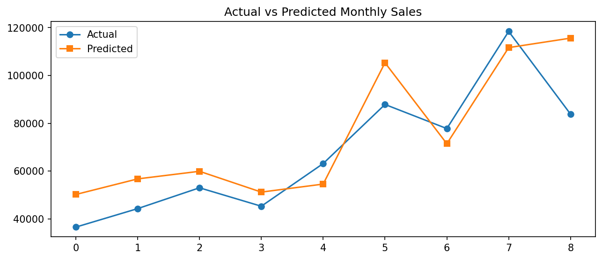

# 📈 Sales Forecasting with Machine Learning
> Prediksi penjualan bulanan menggunakan pendekatan supervised machine learning
> berbasis data historis transaksi retail Superstore (2014–2017).

---

## 📌 Business Problem

Perusahaan retail sering kesulitan mengantisipasi fluktuasi penjualan bulanan,
yang berdampak pada manajemen stok, alokasi anggaran promosi, dan perencanaan
pengiriman. Proyek ini membangun model prediksi penjualan bulanan untuk membantu
pengambilan keputusan yang lebih data-driven.

**Pertanyaan utama:**
- Berapa estimasi total penjualan bulan berikutnya?
- Faktor apa yang paling berpengaruh terhadap penjualan bulanan?
- Model mana yang paling akurat untuk forecasting pada dataset ini?

---

## 📁 Dataset

| Attribute | Detail |
|---|---|
| **Source** | [Sample Superstore — Kaggle](https://www.kaggle.com/datasets/vivek468/superstore-dataset-final) |
| **Period** | Januari 2014 – Desember 2017 |
| **Records** | 9,994 transaksi |
| **Features (raw)** | 21 kolom |
| **Features (after FE)** | 24 kolom |

**Kolom utama yang digunakan:**
`Order Date`, `Sales`, `Profit`, `Quantity`, `Discount`, `Category`, `Region`, `Segment`

---

## 🛠️ Tools & Technologies


---

## 🔄 Project Workflow

```
Raw Data (CSV)
    │
    ├── 1. Data Understanding & EDA
    ├── 2. Preprocessing
    │       ├── Type Conversion (datetime)
    │       ├── Feature Engineering (8 fitur baru)
    │       ├── Outlier Handling (IQR Winsorization)
    │       ├── Negative Profit Flagging
    │       └── Column Selection
    ├── 3. Agregasi Bulanan + Lag Features
    ├── 4. Model Training & Evaluation
    │       ├── Linear Regression
    │       ├── Random Forest Regressor
    │       └── Gradient Boosting Regressor
    └── 5. Visualisasi Hasil & Interpretasi
```

---

## 🧹 Preprocessing Summary

| Tahap | Aksi | Output |
|---|---|---|
| Type Conversion | `object` → `datetime64` | Siap kalkulasi waktu |
| Feature Engineering | Tambah 8 kolom baru | Dataset lebih informatif |
| Outlier Capping | IQR Winsorization | Distribusi lebih sehat |
| Negative Profit | Flagging (tidak dihapus) | Insight bisnis tersedia |
| Column Drop | Hapus 10 kolom ID | Reduksi noise untuk ML |

**Key Finding saat preprocessing:**
- 18.7% transaksi menghasilkan profit negatif
- 97.7% transaksi dengan diskon ≥ 40% berakhir rugi
- Sub-kategori paling rentan rugi: Tables, Bookcases, Supplies

---

## ⚙️ Feature Engineering untuk ML

Dari data transaksi harian, dilakukan **agregasi ke level bulanan** lalu
ditambahkan fitur berbasis waktu:

```python
# Lag Features
Sales_Lag1  → penjualan 1 bulan sebelumnya
Sales_Lag2  → penjualan 2 bulan sebelumnya
Sales_Lag3  → penjualan 3 bulan sebelumnya

# Rolling Average
Sales_Rolling3 → rata-rata 3 bulan terakhir
Sales_Rolling6 → rata-rata 6 bulan terakhir
```

**Final features untuk model:**
`Month`, `Quantity`, `Avg_Discount`, `Num_Orders`,
`Sales_Lag1`, `Sales_Lag2`, `Sales_Lag3`, `Sales_Rolling3`, `Sales_Rolling6`

---

## 📊 Model Results

| Model | MAE | RMSE | R² Score |
|---|---|---|---|
| **Linear Regression** ✅ | $12,212 | $14,533 | **0.661** |
| Gradient Boosting | $12,744 | $15,423 | 0.618 |
| Random Forest | $12,759 | $16,227 | 0.577 |

> **Best Model: Linear Regression** dengan R² = 0.661
> Model mampu menjelaskan **66.1% variasi penjualan bulanan**.
> Linear Regression unggul karena dataset bulanan relatif kecil (42 baris)
> sehingga model sederhana lebih stabil dibanding ensemble.

---

## 🔍 Key Insights

1. **Seasonality kuat** — Penjualan konsisten melonjak setiap Q4 (Oktober–Desember), kemungkinan driven by holiday season
2. **Growth trend positif** — Total sales tumbuh dari $484K (2014) menjadi $733K (2017), atau **+51.4% dalam 4 tahun**
3. **Diskon tinggi = rugi** — Diskon ≥ 40% hampir selalu menghasilkan profit negatif, perlu evaluasi kebijakan diskon
4. **Technology paling profitable** — Margin profit tertinggi meski volume transaksinya paling rendah di antara 3 kategori
5. **Lag features dominan** — `Sales_Lag1` adalah prediktor terkuat, menandakan penjualan bulan ini sangat dipengaruhi bulan sebelumnya

---

## 📈 Visualizations

### Actual vs Predicted Sales
Perbandingan nilai aktual vs prediksi model terbaik (Linear Regression, R²=0.661).



---
